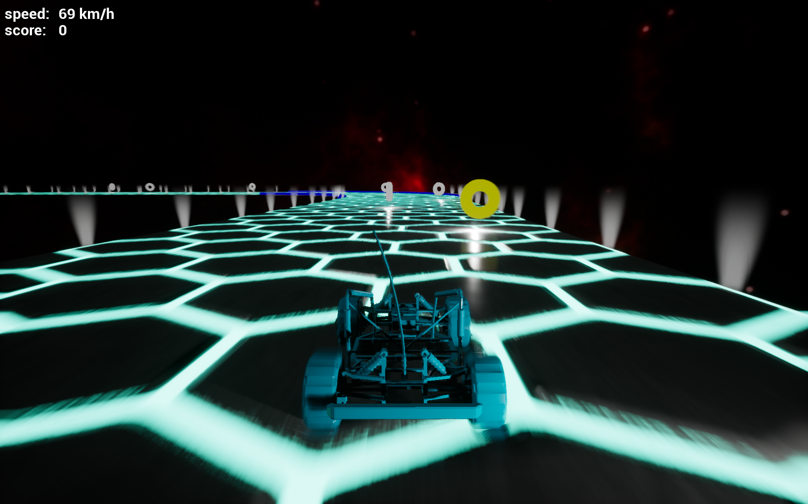

Endless Racer using Unreal Engine 4 
=========

The game was created just using Blueprints Visual Scripting system of the UE4 as an assignment for the [Game Development Middleware course](https://gamedev.cuni.cz/study/fields/game-programming-mff-cuni-cz/) at the MFF at Charles University. The whole project is based on the Advanced Vehicle example and was extended by following steps introduced in [this](https://www.youtube.com/watch?v=yS-yQfo0lc0) great tutorial.

## Code & running

The sources are compatible with Unreal Engine 4.21.0 and the whole project should be working immediately after cloning, all unnecessary assests were removed (from the original Advanced Vehicle exmaple). [Here](https://drive.google.com/file/d/1vaaN-xmJyTJwTgppxts9I0V6VZd1gTJ6/view?usp=sharing) is a Windows build.

## Gameplay
Arrows, note that the car can be slowed down by the down arrow (unfortunately, it is impossible to survive a turn without utilizing this feature).

  

## Credits

All assets except the space dome are part of the Advanced vehicle example. The skybox was created using a great tool [Spacescape](http://alexcpeterson.com/spacescape/).

